# 🏭 EDGERACK Cooling Unit Control System

<div align="center">

[](https://www.typescriptlang.org/)
[](https://reactjs.org/)
[](https://expressjs.com/)
[](https://tailwindcss.com/)
[](https://vitejs.dev/)

*Professional industrial monitoring and control system for EDGERACK cooling units with real-time data visualization and comprehensive system management.*

</div>

## 📋 Table of Contents

- [🌟 Overview](#-overview)
- [🏗️ System Architecture](#️-system-architecture)
- [📊 Application Flow Diagrams](#-application-flow-diagrams)
- [⚡ Real-time Data Pipeline](#-real-time-data-pipeline)
- [🎯 Features & Capabilities](#-features--capabilities)
- [🚀 Quick Start Guide](#-quick-start-guide)
- [📁 Project Structure](#-project-structure)
- [🔧 Development Workflow](#-development-workflow)
- [📖 API Documentation](#-api-documentation)
- [🎨 UI/UX Design System](#-uiux-design-system)
- [🔐 Security & Authentication](#-security--authentication)
- [📱 Page-by-Page Guide](#-page-by-page-guide)
- [🛠️ Technical Stack](#️-technical-stack)
- [🚢 Deployment](#-deployment)
- [🤝 Contributing](#-contributing)

## 🌟 Overview

The EDGERACK Cooling Unit Control System is a modern, industrial-grade web application designed for real-time monitoring and control of cooling units in data centers and industrial environments. Built with React and Express.js, it provides comprehensive system visualization, real-time data updates, and professional industrial aesthetics.

### Key Highlights
- **Real-time Monitoring**: 1-second interval updates for live system data
- **Industrial Design**: Professional dark theme optimized for 24/7 monitoring
- **Responsive Architecture**: Mobile-first design for desktop, tablet, and mobile
- **Type-safe Development**: Full TypeScript implementation across frontend and backend
- **Modular Components**: Reusable UI components with shadcn/ui foundation
- **Performance Optimized**: Efficient data fetching with TanStack Query

## 🏗️ System Architecture

```mermaid
graph TB
    subgraph "🖥️ Frontend Layer"
        A[React App] --> B[Wouter Router]
        B --> C[TanStack Query]
        C --> D[Real-time Data Hook]
        D --> E[API Request Layer]
        
        F[shadcn/ui Components] --> G[Tailwind CSS]
        G --> H[Replit Dark Theme]
        
        I[Authentication Context] --> J[Session Management]
    end
    
    subgraph "⚡ Backend Layer"
        K[Express Server] --> L[TypeScript Routes]
        L --> M[Storage Interface]
        M --> N[Memory Storage]
        N --> O[Mock Data Generator]
        
        P[Session Middleware] --> Q[Auth Handlers]
    end
    
    subgraph "📊 Data Flow"
        O --> R[Sensor Simulation]
        R --> S[Real-time Updates]
        S --> T[API Endpoints]
        T --> E
        
        U[User Interactions] --> V[State Updates]
        V --> W[UI Re-render]
    end
    
    subgraph "🎨 Design System"
        X[Industrial Theme] --> Y[Color Variables]
        Y --> Z[Component Styling]
        Z --> AA[Responsive Layout]
    end
    
    E --> T
    J --> Q
    H --> Z
    
    classDef frontend fill:#2563eb,stroke:#1d4ed8,color:#ffffff
    classDef backend fill:#dc2626,stroke:#b91c1c,color:#ffffff
    classDef data fill:#059669,stroke:#047857,color:#ffffff
    classDef design fill:#7c3aed,stroke:#6d28d9,color:#ffffff
    
    class A,B,C,D,E,F,G,H,I,J frontend
    class K,L,M,N,O,P,Q backend
    class R,S,T,U,V,W data
    class X,Y,Z,AA design
```



## 📊 Application Flow Diagrams

### 🔄 Complete User Journey Flow


### 🌐 Navigation & Routing Flow


## ⚡ Real-time Data Pipeline


## 🎯 Features & Capabilities

### 🏠 **HomeView Dashboard**
- **Multi-section Overview**: Cabinet signals, cooling unit metrics, networking, and system information
- **Expandable Panels**: Collapsible sections with expand/collapse all functionality
- **Real-time Monitoring**: Live updates for all system parameters
- **Alert System**: Visual indicators for system errors and warnings
- **Status Badges**: Color-coded indicators for operational states

### ❄️ **CoolingView Technical Readings**
- **Detailed Metrics**: Temperature, pressure, fan speeds, and motor status
- **States Monitoring**: Compressor, heating, cooling, and alarm states
- **Values Display**: Real-time sensor readings with professional formatting
- **Technical Layout**: Industrial-style data presentation
- **MODBUS Integration**: Communication status and data validation

### 👥 **AdminView Management**
- **User Management**: Account creation, editing, and role assignment
- **System Logs**: Comprehensive event logging and audit trails
- **Backup Operations**: System backup creation and restoration
- **Security Controls**: Authentication and authorization management
- **Activity Monitoring**: User session tracking and access logging

### ⚙️ **ConfigView Settings**
- **General Settings**: Temperature units, time zones, and basic preferences
- **Cooling Configuration**: Setpoints, thresholds, and control parameters
- **Network Settings**: IP configuration, DNS, and connectivity options
- **Administration**: Event log management and system maintenance

### 🔧 **UpgradeView System Management**
- **Firmware Updates**: System upgrade management and version control
- **Diagnostics**: Performance monitoring and health checks
- **Maintenance**: Scheduled tasks and system optimization
- **Hardware Status**: Component health and replacement indicators

## 🚀 Quick Start Guide

### Prerequisites
```bash
- Node.js 18+ 
- npm or yarn package manager
- Modern web browser (Chrome, Firefox, Safari, Edge)
```

### Installation Steps

1. **Clone the repository**:
```bash
git clone <repository-url>
cd edgerack-cooling-control
```

2. **Install dependencies**:
```bash
npm install
```

3. **Start development server**:
```bash
npm run dev
```

4. **Access the application**:
   - Open browser to `http://localhost:5000`
   - Login with default credentials: `admin` / `enconnex`
   - Explore the dashboard and monitoring features

### Development Commands
```bash
npm run dev      # Start development server with hot reload
npm run build    # Build for production
npm run preview  # Preview production build locally
npm run lint     # Run ESLint for code quality
npm run type-check # TypeScript compilation check
```

## 📁 Project Structure

```
edgerack-cooling-control/
├── 📁 client/                    # React frontend application
│   ├── 📁 src/
│   │   ├── 📁 components/        # Reusable UI components
│   │   │   ├── SiteNavigation.tsx
│   │   │   └── UserLoginModal.tsx
│   │   ├── 📁 pages/             # Page components (route views)
│   │   │   ├── HomeView.tsx      # Main dashboard
│   │   │   ├── CoolingView.tsx   # Technical readings
│   │   │   ├── AdminView.tsx     # Administration
│   │   │   ├── ConfigView.tsx    # Configuration
│   │   │   ├── UpgradeView.tsx   # System upgrade
│   │   │   └── RCUView.tsx       # RCU controls
│   │   ├── 📁 hooks/             # Custom React hooks
│   │   │   ├── use-auth.tsx      # Authentication logic
│   │   │   ├── use-real-time-data.tsx # Data fetching
│   │   │   ├── use-mobile.tsx    # Responsive utilities
│   │   │   └── use-toast.ts      # Notification system
│   │   ├── 📁 lib/               # Utilities and configuration
│   │   │   ├── queryClient.ts    # TanStack Query setup
│   │   │   └── utils.ts          # Helper functions
│   │   ├── App.tsx               # Main application component
│   │   ├── main.tsx              # React application entry
│   │   └── index.css             # Global styles and theme
│   └── index.html                # HTML template
├── 📁 server/                    # Express backend application
│   ├── index.ts                  # Server entry point
│   ├── routes.ts                 # API route definitions
│   ├── storage.ts                # Data storage interface
│   └── vite.ts                   # Vite integration
├── 📁 shared/                    # Shared types and schemas
│   └── schema.ts                 # TypeScript type definitions
├── 📁 docs/                      # Documentation files
│   ├── API.md                    # API documentation
│   ├── DEPLOYMENT.md             # Deployment guide
│   ├── CONTRIBUTING.md           # Contribution guidelines
│   └── CHANGELOG.md              # Version history
├── 📄 package.json               # Dependencies and scripts
├── 📄 tsconfig.json              # TypeScript configuration
├── 📄 tailwind.config.ts         # Tailwind CSS configuration
├── 📄 vite.config.ts             # Vite build configuration
└── 📄 README.md                  # This file
```

## 🔧 Development Workflow

### 🔄 **Hot Module Replacement (HMR)**


### 🧪 **Development Cycle**
1. **Code Editing**: Make changes to React components or Express routes
2. **Automatic Compilation**: TypeScript compiles in real-time
3. **Hot Reload**: Vite updates the browser without full page refresh
4. **State Preservation**: React state maintained during updates
5. **Real-time Testing**: Immediate feedback loop for development

### 🛠️ **Build Process**
```bash
# Development build with source maps
npm run dev

# Production build with optimization
npm run build

# Preview production build
npm run preview
```

## 📖 API Documentation

### 🔗 Core Endpoints

#### **Cooling Unit Data**
```typescript
GET /api/cooling-unit/data
Response: {
  id: string;
  timestamp: string;
  temperature: {
    supply: number;
    return: number;
    ambient: number;
  };
  pressure: {
    high: number;
    low: number;
  };
  fans: {
    internal: number;
    external: number;
    condenser: number;
  };
  states: {
    compressor: boolean;
    heating: boolean;
    cooling: boolean;
    alarm: boolean;
  };
}
```

#### **Authentication**
```typescript
POST /api/auth/login
Body: {
  username: string;
  password: string;
  remember?: boolean;
}
Response: {
  success: boolean;
  user?: UserInfo;
  message: string;
}
```

#### **System Configuration**
```typescript
PUT /api/config/settings
Body: {
  temperatureUnits: 'celsius' | 'fahrenheit';
  timezone: string;
  alertSettings: AlertConfig;
}
Response: {
  success: boolean;
  message: string;
}
```

### 📊 **Real-time Data Format**
All real-time endpoints return data with:
- **Unique ID**: Each data point has a unique identifier
- **Timestamp**: ISO 8601 formatted timestamp
- **Type Safety**: Full TypeScript interface definitions
- **Validation**: Zod schema validation on all inputs

## 🎨 UI/UX Design System

### 🎭 **Theme Architecture**
```css
/* Replit-inspired Dark Theme */
:root {
  --background: hsl(222, 28%, 8%);      /* Deep dark background */
  --card: hsl(217, 33%, 17%);           /* Card surfaces */
  --primary: hsl(217, 91%, 59%);        /* Replit blue accent */
  --secondary: hsl(215, 25%, 27%);      /* Secondary elements */
  --muted: hsl(215, 14%, 34%);          /* Muted text */
  --accent: hsl(216, 87%, 52%);         /* Accent colors */
}
```

### 🧱 **Component Library**
- **shadcn/ui Foundation**: Professional, accessible UI components
- **Custom EDGERACK Styling**: Industrial-specific customizations
- **Responsive Grid System**: Mobile-first responsive design
- **Status Indicators**: Color-coded badges and indicators
- **Interactive Elements**: Hover states and focus management

### 🎯 **Design Principles**
1. **Industrial Aesthetics**: Professional appearance for industrial environments
2. **High Contrast**: Excellent readability in various lighting conditions
3. **Consistent Spacing**: Systematic spacing and typography scale
4. **Accessibility**: WCAG 2.1 compliance for inclusive design
5. **Performance**: Optimized rendering and minimal layout shifts

## 🔐 Security & Authentication

### 🛡️ **Authentication Flow**


### 🔑 **Security Features**
- **Session-based Authentication**: Secure server-side session management
- **Protected Routes**: Role-based access control for administrative functions
- **Input Validation**: Comprehensive data validation with Zod schemas
- **CSRF Protection**: Cross-site request forgery prevention
- **Secure Headers**: Security headers for production deployment

### 👤 **User Roles**
- **Administrator**: Full system access and user management
- **Operator**: Monitoring and basic control functions
- **Maintenance**: Technical access and system diagnostics
- **Viewer**: Read-only monitoring access

## 📱 Page-by-Page Guide

### 🏠 **HomeView (/) - Main Dashboard**
**Purpose**: Comprehensive system overview with real-time monitoring

**Key Features**:
- **Expand All Controls**: Toggle all sections simultaneously
- **Cabinet Signals**: Door sensors, alarms, and security status
- **Cooling Unit Metrics**: Live temperature, pressure, and fan data
- **Network Information**: Primary/secondary network status and NTP sync
- **System Information**: CPU usage, memory, and storage metrics

**User Interactions**:
- Expand/collapse individual sections
- Real-time data updates every second
- System alert notifications
- Quick status overview

### ❄️ **CoolingView (/cooling) - Technical Readings**
**Purpose**: Detailed technical monitoring for cooling system operators

**Key Features**:
- **States Section**: Compressor, heating, cooling, and alarm states
- **Values Section**: Temperature readings, pressures, and fan speeds
- **MODBUS Status**: Communication health and data validation
- **Historical Context**: Last updated timestamps and trend indicators

**User Interactions**:
- Toggle between states and values views
- Expand all technical sections by default
- Monitor critical system parameters
- Troubleshoot system issues

### 👥 **AdminView (/user) - System Administration**
**Purpose**: User management and system administration

**Key Features**:
- **User Management**: Create, edit, and manage user accounts
- **System Logs**: View and export system event logs
- **Backup & Restore**: Create and manage system backups
- **Role Assignment**: Assign and modify user permissions

**User Interactions**:
- Add new users with role assignment
- Export system logs for analysis
- Create and restore system backups
- Monitor user activity and sessions

### ⚙️ **ConfigView (/config) - System Configuration**
**Purpose**: System settings and parameter configuration

**Key Features**:
- **General Settings**: Temperature units, timezone, and NTP configuration
- **Cooling Settings**: Setpoints, thresholds, and control parameters
- **Network Settings**: IP configuration, DNS, and gateway settings
- **Administration**: Event log management and system preferences

**User Interactions**:
- Modify system preferences
- Configure network parameters
- Set cooling system thresholds
- Manage administrative settings

### 🔧 **UpgradeView (/upgrade) - System Management**
**Purpose**: System maintenance, upgrades, and diagnostics

**Key Features**:
- **Firmware Management**: Check for and install system updates
- **System Diagnostics**: Performance monitoring and health checks
- **Maintenance Scheduling**: Plan and execute maintenance tasks
- **Hardware Status**: Monitor component health and replacement needs

**User Interactions**:
- Check for system updates
- Run diagnostic tests
- Schedule maintenance windows
- Monitor hardware health

## 🛠️ Technical Stack

### 🎯 **Frontend Technologies**
```typescript
// Core Framework
React 18.x          // Modern React with concurrent features
TypeScript 5.x      // Type-safe development
Vite 5.x           // Fast build tool and dev server

// State Management
TanStack Query 5.x  // Server state management
React Context       // Global application state

// UI Framework
shadcn/ui          // Professional component library
Tailwind CSS 3.x   // Utility-first CSS framework
Radix UI           // Accessible primitive components

// Routing & Navigation
Wouter             // Lightweight React router
React Hook Form    // Form handling and validation

// Development Tools
ESLint             // Code linting and quality
Prettier           // Code formatting
```

### ⚙️ **Backend Technologies**
```typescript
// Core Framework
Node.js 18+        // JavaScript runtime
Express.js 4.x     // Web application framework
TypeScript 5.x     // Type-safe server development

// Database & ORM
PostgreSQL         // Production database
Drizzle ORM        // Type-safe database operations
Neon               // Serverless PostgreSQL provider

// Validation & Security
Zod                // Schema validation
Express Session    // Session management
CORS               // Cross-origin resource sharing

// Development Tools
tsx                // TypeScript execution
Nodemon            // Development server restart
```

### 🔧 **Development Tools**
```json
{
  "buildTool": "Vite 5.x",
  "packageManager": "npm",
  "codeEditor": "VS Code",
  "deployment": "Replit",
  "versionControl": "Git",
  "cicd": "GitHub Actions"
}
```

## 🚢 Deployment

### 🏗️ **Production Build**
```bash
# Create optimized production build
npm run build

# Preview production build locally
npm run preview

# Start production server
npm start
```

### ☁️ **Replit Deployment**
1. **Environment Setup**: Configure environment variables
2. **Database Connection**: Set up PostgreSQL connection
3. **Build Process**: Automated build on deployment
4. **Health Checks**: Automatic health monitoring
5. **Custom Domain**: Optional custom domain configuration

### 🔧 **Environment Variables**
```bash
# Database Configuration
DATABASE_URL=postgresql://...
PGHOST=localhost
PGPORT=5432
PGUSER=username
PGPASSWORD=password
PGDATABASE=edgerack

# Application Settings
NODE_ENV=production
PORT=5000
SESSION_SECRET=your-secret-key

# Optional Features
VITE_API_BASE_URL=https://your-domain.com
```

### 📊 **Performance Optimizations**
- **Code Splitting**: Automatic route-based code splitting
- **Bundle Analysis**: Webpack bundle analyzer integration
- **Image Optimization**: Automated image compression and formats
- **Caching Strategy**: Browser caching for static assets
- **CDN Integration**: Content delivery network support

## 🤝 Contributing

### 🔄 **Development Process**
1. **Fork Repository**: Create a personal fork of the project
2. **Feature Branch**: Create a new branch for your feature
3. **Development**: Make changes following coding standards
4. **Testing**: Ensure all tests pass and add new tests
5. **Pull Request**: Submit PR with detailed description

### 📋 **Coding Standards**
```typescript
// TypeScript Conventions
- Use strict TypeScript settings
- Define interfaces for all data structures
- Implement proper error handling
- Follow functional programming patterns

// React Conventions
- Use functional components with hooks
- Implement proper component lifecycle
- Follow React best practices
- Use TypeScript for props and state

// Styling Conventions
- Use Tailwind CSS utility classes
- Follow mobile-first responsive design
- Implement accessible design patterns
- Maintain consistent spacing and typography
```

### 🧪 **Testing Guidelines**
- **Unit Tests**: Test individual components and functions
- **Integration Tests**: Test component interactions
- **E2E Tests**: Test complete user workflows
- **Performance Tests**: Monitor application performance
- **Accessibility Tests**: Ensure WCAG 2.1 compliance

### 📝 **Documentation Requirements**
- **Code Comments**: Comprehensive inline documentation
- **Type Definitions**: Complete TypeScript interfaces
- **README Updates**: Keep documentation current
- **Changelog**: Document all significant changes
- **API Documentation**: Maintain accurate API docs

---

<div align="center">

### 🎯 **Ready to Monitor Your Cooling Systems?**

**[Get Started](#-quick-start-guide)** • **[View API Docs](docs/API.md)** • **[Contributing Guide](docs/CONTRIBUTING.md)**

*Built with ❤️ for industrial monitoring excellence*

[](https://opensource.org/licenses/MIT)
[](http://makeapullrequest.com)

</div>