# EDGERACK Cooling Unit Control System - Application Flow Diagram

## 🏗️ **Elevated Architecture & Workflow Overview**



```mermaid
graph TB
    %% Frontend Layer
    subgraph "Frontend Layer (React + TypeScript)"
        A[React Router - Wouter] --> B[Site Navigation]
        B --> C{Route Handler}
        C -->|"/"| D[HomeView]
        C -->|"/cooling"| E[CoolingView] 
        C -->|"/user"| F[AdminView]
        C -->|"/config"| G[ConfigView]
        C -->|"/upgrade"| H[UpgradeView]
        C -->|"/rcu"| I[RCUView]
        
        %% Real-time Data Flow
        J[TanStack Query] --> K[Real-time Data Hook]
        K --> L[Polling Service]
        L --> M[API Request Layer]
    end

    %% Authentication Layer
    subgraph "Authentication & State"
        N[Auth Context] --> O[Session Management]
        O --> P[Login Modal]
        P --> Q[User State]
    end

    %% Backend API Layer
    subgraph "Backend Layer (Express + TypeScript)"
        R[Express Server] --> S[Route Handlers]
        S --> T[Storage Interface]
        T --> U[Memory Storage]
        U --> V[Mock Data Generator]
        
        %% API Endpoints
        S --> W["/api/cooling-unit/data"]
        S --> X["/api/auth/*"]
        S --> Y["/api/config/*"]
        S --> Z["/api/system/*"]
    end

    %% Data Flow Connections
    M --> W
    M --> X
    M --> Y
    M --> Z
    
    %% Real-time Updates
    V --> AA[Simulated Sensor Data]
    AA --> BB[Temperature Readings]
    AA --> CC[Fan Speeds]
    AA --> DD[System States]
    AA --> EE[Network Status]
    
    %% UI Components
    D --> FF[Cabinet Signals]
    D --> GG[Cooling Unit Metrics]
    D --> HH[Network Information]
    D --> II[System Information]
    
    E --> JJ[States Section]
    E --> KK[Values Section]
    E --> LL[Expand/Collapse Controls]
    
    F --> MM[User Management]
    F --> NN[System Logs]
    F --> OO[Backup & Restore]
    
    %% Styling & Theme
    subgraph "Design System"
        PP[Replit Dark Theme] --> QQ[shadcn/ui Components]
        QQ --> RR[Tailwind CSS]
        RR --> SS[Custom EDGERACK Styling]
    end

    %% Development Workflow
    subgraph "Development Environment"
        TT[Vite Development Server] --> UU[Hot Module Replacement]
        UU --> VV[TypeScript Compilation]
        VV --> WW[Replit Environment]
    end

    %% Data Flow Arrows
    L -.->|"1-second polling"| W
    BB -.->|"Real-time"| GG
    CC -.->|"Real-time"| GG
    DD -.->|"Real-time"| FF
    EE -.->|"Real-time"| HH
    
    %% Styling Connections
    PP --> D
    PP --> E
    PP --> F
    PP --> G
    PP --> H
    PP --> I

    %% Authentication Flow
    N --> F
    Q -.->|"Conditional Rendering"| MM

    classDef frontend fill:#2563eb,stroke:#1d4ed8,stroke-width:2px,color:#ffffff
    classDef backend fill:#dc2626,stroke:#b91c1c,stroke-width:2px,color:#ffffff
    classDef data fill:#059669,stroke:#047857,stroke-width:2px,color:#ffffff
    classDef auth fill:#7c3aed,stroke:#6d28d9,stroke-width:2px,color:#ffffff
    classDef design fill:#ea580c,stroke:#c2410c,stroke-width:2px,color:#ffffff
    classDef dev fill:#374151,stroke:#1f2937,stroke-width:2px,color:#ffffff

    class A,B,C,D,E,F,G,H,I,J,K,L,M frontend
    class R,S,T,U,V,W,X,Y,Z backend
    class AA,BB,CC,DD,EE,FF,GG,HH,II,JJ,KK,LL,MM,NN,OO data
    class N,O,P,Q auth
    class PP,QQ,RR,SS design
    class TT,UU,VV,WW dev
```

## 🔄 **Application Flow Explanation**

### **1. Initial Application Bootstrap**
```
Replit Environment → Vite Server → React App Mount → Route Resolution
```

### **2. Navigation & Routing Flow**
```
User Navigation → Wouter Router → Route Component → Data Fetching → UI Render
```

### **3. Real-time Data Pipeline**
```
Mock Data Generator → Memory Storage → API Endpoint → TanStack Query → UI Updates
```

### **4. Authentication Workflow**
```
Login Modal → Auth Context → Session Management → Conditional UI Rendering
```

### **5. Component Interaction Flow**
```
User Interaction → State Update → API Call → Data Refresh → UI Re-render
```

## 📊 **Key System Components**

### **Frontend Architecture**
- **Router**: Wouter for lightweight client-side routing
- **State Management**: React Context + TanStack Query
- **UI Framework**: shadcn/ui with Tailwind CSS
- **Real-time Updates**: Polling-based data fetching (1-second intervals)

### **Backend Architecture**
- **Server**: Express.js with TypeScript
- **Storage**: In-memory storage with mock data simulation
- **API Design**: RESTful endpoints with real-time data generation
- **Session**: Memory-based session management

### **Data Flow Patterns**
- **Polling Strategy**: Continuous 1-second intervals for real-time feeling
- **Optimistic Updates**: Immediate UI feedback with server sync
- **State Synchronization**: TanStack Query cache management
- **Error Handling**: Graceful degradation with retry mechanisms

### **Industrial UI Design**
- **Theme**: Replit-inspired dark theme with EDGERACK branding
- **Responsive**: Mobile-first design with industrial aesthetics
- **Accessibility**: Keyboard navigation and screen reader support
- **Performance**: Optimized component rendering and data fetching

## 🎯 **Page-Specific Workflows**

### **HomeView (/)**
```
Mount → Fetch All Data → Render Expandable Sections → Real-time Updates
└── Cabinet Signals → Cooling Unit Metrics → Network Info → System Info
```

### **CoolingView (/cooling)**
```
Mount → Fetch Cooling Data → Render Technical Readings → Continuous Updates
└── States Section → Values Section → Expand All Controls
```

### **AdminView (/user)**
```
Mount → Check Auth → Render Admin Tabs → Handle User Actions
└── User Management → System Logs → Backup/Restore
```

### **ConfigView (/config)**
```
Mount → Fetch Config → Render Settings Forms → Save Changes
└── General → Cooling → Network → Administration
```

## 🔧 **Development Workflow**

### **Hot Development Cycle**
```
Code Change → Vite HMR → React Re-render → Browser Update (< 100ms)
```

### **Build Process**
```
TypeScript → Vite Bundle → Static Assets → Replit Deployment
```

### **Error Handling Flow**
```
Runtime Error → Error Boundary → User Notification → Graceful Fallback
```

## 🚀 **Deployment & Scaling**

### **Current Architecture**
- **Single-instance**: Monolithic application with embedded API
- **Real-time**: Polling-based updates suitable for development/testing
- **Storage**: In-memory with data persistence through browser sessions

### **Production Considerations**
- **Database**: PostgreSQL integration with Drizzle ORM ready
- **Real-time**: WebSocket upgrade path available
- **Scaling**: Microservice decomposition potential
- **Monitoring**: Industrial-grade logging and alerting integration

---

*This diagram represents the comprehensive application flow of the EDGERACK Cooling Unit Control System, showcasing the modern full-stack architecture with real-time industrial monitoring capabilities.*